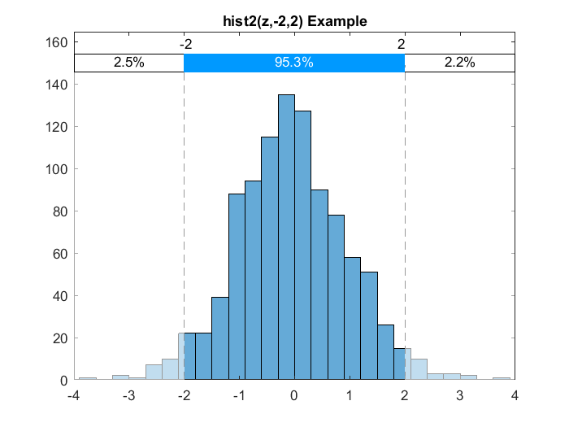
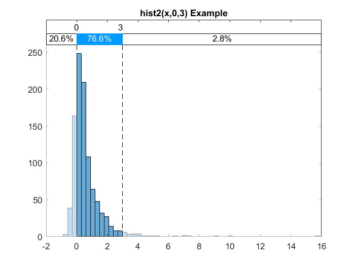

# hist2(.) - A Histogram plus Cumulative Probabilities
  

*About the image: When the sample of random numbers comes from the standard normal distribution, we expect to see approximately 95% of observations between -2 and 2.*

## About the function
This MATLAB function plots a histogram and shows the cumulative distributions between two critical points graphically. The probabilities are also accessible as outputs.

## Syntax
```
hist2(X,a,b)
hist2(X,a)
hist2(X)
[h p1 p2 p3] = hist2(__) 
```

## Description
```
hist2(X,a,b): 
```
X is a random vector. When both **a** and **b** are supplied, the cumulative probabilities will be computed and shown for the following ranges:  
**[min(X) to a]** _on the Left_  
**(a,b)** _in the Middle_   
**[b to max(X)]** _on the Right_<br />  
When only **a** is supplied, then **b** is assumed to be the max(X). If only **X** is supplied, then **a** and **b** are assumed to be the median(X) and max(X) respectively. 
With the last syntax, the handle to the histogram (h) plus cumulative probabilities (p1,p2, and p3) are accessible as outputs.  

## How to Use
Please simply download hist2.m file. There are two ways for using the function. First is to copy hist2.m to the “current folder” in which your scripts are running. Second is to add the path of the folder containing hist2.m to MATLAB's search path, then it can be used in any script or function. To add the path, you can use the “addpath” command, or from Home menu open the “Set path” window and add the path.  

## Typical Applications
I initially wrote the function for some financial applications, for example for visualizing the Value at Risk (VaR) or the distribution of difference between returns of two portfolios in a Monte Carlo simulation. However it can be used in any other situation when we are interested in computing and visualizing the cumulative probabilities for a specific range in the data.   


